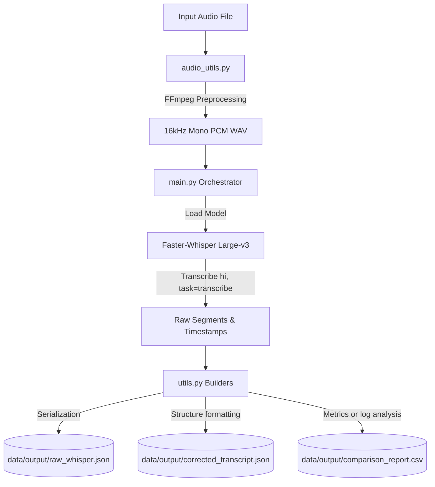

# Hindi-ASR

A modular, production-ready Automatic Speech Recognition (ASR) system built to transcribe pure Hindi audio in Devanagari script with high accuracy. 

The system leverages **FFmpeg** for robust audio preprocessing (standardization, EBU R128 loudness normalization, and FFT-based noise reduction) and **Faster-Whisper Large-v3** for transcription.

---

## 1. Final Folder Structure

```text
Hindi-ASR/
├── README.md
├── requirements.txt
├── app.py                      # FastAPI backend service wrapper
├── .venv/                      # Python virtual environment (ignored in git)
├── uploads/                    # Temporary storage for uploaded audio and request output files
├── data/
│   ├── input/                  # Store raw input audio files here
│   └── output/                 # Preprocessed audio, JSON transcripts, and CSV reports
└── src/
    ├── audio_utils.py          # FFmpeg audio preprocessing operations
    ├── main.py                 # CLI entrypoint and orchestrator
    └── utils.py                # File I/O, format builders, and evaluation metrics (WER/CER)
```

---

## 2. Architecture Diagram



---

## 3. Execution Flow

1. **CLI Parsing**: `main.py` parses arguments including options for noise reduction, loudness normalization, custom models, and device choice.
2. **Audio Preprocessing**: `audio_utils.py` executes an asynchronous-ready `ffmpeg` subprocess. The audio is resampled to 16kHz, converted to mono channel, encoded as 16-bit PCM WAV, and optionally denoised and normalized.
3. **Model Initialization**: The `faster-whisper` engine loads the requested model (default `large-v3`) onto the chosen device (`cpu` or `cuda`).
4. **Transcription**: The model processes the WAV audio, enforcing language as Hindi (`hi`) and task as `transcribe`. It produces segment-level and word-level timestamps and probability scores.
5. **Output Generation**:
   - **`raw_whisper.json`**: Direct dumps of raw model segments and word data.
   - **`corrected_transcript.json`**: Output containing full transcript text, language details, segment-level and word-level details.
   - **`comparison_report.csv`**: A CSV log listing each segment's duration, confidence, and transcription. If a ground-truth transcript is supplied, computes and logs Word Error Rate (WER) and Character Error Rate (CER).

---

## 4. Dependencies Used

- **System Dependency**: `FFmpeg` (version >= 4.0 recommended).
- **Python Dependencies**:
  - `faster-whisper`: Optimized Whisper inference engine built on CTranslate2.
  - `numpy`: High-performance mathematical computing.
  - `jiwer`: Evaluation of Word Error Rate (WER) and Character Error Rate (CER) against ground truth.

---

## 5. Commands to Run the Project

### Setup

```bash
# Navigate to the project root
cd /Users/pranjalsingh/Desktop/Hindi-ASR

# Set up virtual environment
python3 -m venv .venv

# Activate virtual environment
source .venv/bin/activate

# Install dependencies
pip install -r requirements.txt
```

### Execution

Run the ASR pipeline on an input audio file:

```bash
# Basic transcription (results will be in data/output/)
python src/main.py --input data/input/sample.mp3

# Transcription with loudness normalization and noise reduction enabled
python src/main.py --input data/input/sample.mp3 --normalize --denoise

# Transcription with ground-truth comparison (to compute WER and CER)
python src/main.py --input data/input/sample.mp3 --ground-truth data/input/reference.txt

# Transcription utilizing CUDA GPU acceleration (for NVIDIA graphics cards)
python src/main.py --input data/input/sample.mp3 --device cuda --compute-type float16
```

---

## 6. Module Explanations

### `src/audio_utils.py`
Contains the `preprocess_audio` function. It invokes `ffmpeg` with `-ar 16000 -ac 1 -c:a pcm_s16le`.
- To reduce noise, it passes the FFT-based audio filter `-af afftdn`.
- To normalize audio, it passes the EBU R128 loudness filter `-af loudnorm`.
- If both are requested, they are chained: `-af afftdn,loudnorm`.

### `src/utils.py`
Provides utility functions to serialize model objects, structure data, compute metrics, and write outputs:
- `serialize_segments`: Converts native Faster-Whisper segments and word tuples into raw Python dictionary formats.
- `build_corrected_transcript`: Forms the structured `corrected_transcript.json` with keys (`language`, `language_probability`, `duration`, `segments`, `words`, `timestamps`, `probabilities`, and `full transcript`).
- `calculate_wer_cer`: Calculates Word Error Rate (WER) and Character Error Rate (CER). Uses the `jiwer` package or a custom Levenshtein distance fallback.
- `generate_comparison_report`: Saves a CSV file summarizing segment-level timelines, transcription text, and confidence scores. Optionally appends overall WER/CER statistics if reference text is supplied.

### `src/main.py`
Acts as the central pipeline coordinator. It orchestrates the flow from arguments to preprocessing, model loading, audio decoding, segment consumption, and output storage.

---

## 7. Suggestions for Future Improvements

Without implementing them, the following improvements can enhance the pipeline:

1. **Voice Activity Detection (VAD) Pre-filtering**: Use Silero VAD (which is built into Faster-Whisper but can be tuned) to segment long audio files or strip extended silences prior to transcribing to reduce computation time.
2. **GPU Optimization for Apple Silicon**: Explore integration with Apple Silicon CoreML or optimized ONNX models using the `onnxruntime` backend for macOS GPU (MPS) acceleration.
3. **Devanagari Normalizer**: Implement an Unicode normalizer to resolve issues with Hindi character combinations (like Nuqta normalization, e.g., combining `ड` and Nuqta to form `ड़`).
4. **Vocabulary Boosting (Prompting)**: Utilize the `initial_prompt` argument in Faster-Whisper to feed domain-specific Hindi vocabularies (e.g., medical, legal, or regional terminology) to improve spelling accuracy.
5. **Diarization Integration**: For multi-speaker Hindi audio, integrate a speaker diarization model (like PyAnnote) to attribute segments to different speakers.

---

## 8. Running the Backend Service (Development)

A FastAPI backend wraps the transcription pipeline, allowing you to access the ASR service via standard HTTP APIs.

### Start the Backend Locally

Start the FastAPI application using Uvicorn:

```bash
# Start with auto-reload (uses default cpu and large-v3)
uvicorn app:app --reload
```

---

## 9. Production Deployment Guidelines

The service is configured for production deployment on a GPU server (e.g., RunPod).

### 9.1 Environment Variables Configuration

Configure the application using a `.env` file or environment variables. Create it based on `.env.example`:

| Environment Variable | Description | Default Value |
| --- | --- | --- |
| `MODEL_SIZE` | Faster-Whisper model size to use | `large-v3` |
| `DEVICE` | Target device: `cpu` or `cuda` | `cpu` |
| `COMPUTE_TYPE` | Floating point computation format (e.g. `int8`, `float16`) | `int8` |
| `HOST` | Binding host address | `0.0.0.0` |
| `PORT` | Listening port for the application | `8000` |
| `MAX_UPLOAD_SIZE` | Maximum file size allowed for upload (in bytes) | `52428800` (50MB) |
| `LOG_LEVEL` | Level of logging output (e.g., `DEBUG`, `INFO`, `WARNING`, `ERROR`) | `INFO` |
| `UPLOAD_DIR` | Temp directory for saving uploads and transcripts | `uploads` |

> [!TIP]
> For GPU servers (e.g., RunPod), set `DEVICE=cuda` and `COMPUTE_TYPE=float16` to take advantage of GPU acceleration.

### 9.2 Docker Deployment

#### Build the Docker image:

```bash
docker build -t hindi-asr-backend:latest .
```

#### Run the Docker container (CPU Mode):

```bash
docker run -d \
  -p 8000:8000 \
  --env-file .env \
  --name hindi-asr-backend \
  hindi-asr-backend:latest
```

#### Run the Docker container (GPU Mode - RunPod/NVIDIA GPU):

Make sure the host has `nvidia-container-toolkit` installed.

```bash
docker run -d \
  --gpus all \
  -p 8000:8000 \
  -e DEVICE=cuda \
  -e COMPUTE_TYPE=float16 \
  --env-file .env \
  --name hindi-asr-backend \
  hindi-asr-backend:latest
```

---

## 10. API Specification

### 10.1 Health and Utility Endpoints

#### GET `/`
Basic service status check.
- **Response (200 OK):**
  ```json
  {
    "service": "Hindi-ASR",
    "status": "running"
  }
  ```

#### GET `/health`
Returns model readiness status.
- **Response (200 OK):**
  ```json
  {
    "status": "healthy",
    "model_loaded": true
  }
  ```

#### GET `/version`
Returns the application version.
- **Response (200 OK):**
  ```json
  {
    "version": "1.0.0"
  }
  ```

### 10.2 Transcription Endpoint

#### POST `/transcribe`
Accepts a multipart form data file upload, runs ASR, and returns the transcript.
- **Request Body (Multipart Form):**
  - `file`: The audio file to transcribe (allowed: `.wav`, `.mp3`, `.m4a`, `.aac`).
- **Success Response (200 OK):**
  ```json
  {
    "success": true,
    "language": "hi",
    "transcript": "...",
    "duration": 12.34,
    "segments": [...],
    "clinical": {...}
  }
  ```
- **Error Responses:**
  - **400 Bad Request:** (e.g., unsupported format)
    ```json
    {
      "success": false,
      "error": "Invalid audio"
    }
    ```
  - **413 Request Entity Too Large:** (e.g., file size exceeds `MAX_UPLOAD_SIZE`)
    ```json
    {
      "success": false,
      "error": "File too large"
    }
    ```
  - **500 Internal Server Error:**
    ```json
    {
      "success": false,
      "error": "Internal error"
    }
    ```

### 10.3 Interactive API Documentation

Once the server is running, visit:
- Swagger UI: [http://127.0.0.1:8000/docs](http://127.0.0.1:8000/docs)
- ReDoc: [http://127.0.0.1:8000/redoc](http://127.0.0.1:8000/redoc)


